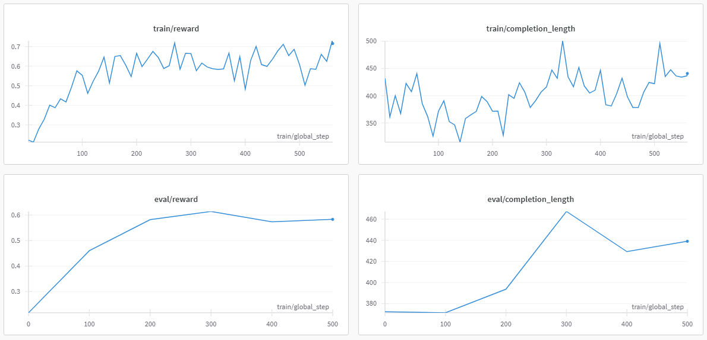

# Simple R1-Zero -- Reproduce Tiny R1-Zero with minimal codes

This is a reproduction of the DeepSeek-R1-Zero on algebra tasks, built upon the [TRL](https://huggingface.co/docs/trl/index) framework. The training dataset we used comes from [X-R1-750](https://huggingface.co/datasets/xiaodongguaAIGC/X-R1-750).

Through GRPO, we've observed an increase in response length and an enhancement in algebraic capabilities for the [Qwen2.5-1.5B](https://huggingface.co/Qwen/Qwen2.5-1.5B) base model.

## Reward Design

- Put answer in `\boxed{}` format: +0.1
- Correct answer: +1

Note: We did not design the reward to force the model to produce the \<think>\</think> and \<answer>\</answer> format because we found it challenging for a 1.5B base model to generate such formats. Instead, we use a `'think step by step'` prompt to encourage the model to think more comprehensively.

## Results

[Wandb Report](https://api.wandb.ai/links/koala1230/yvxvt7se)



## Example

Prompt:

```
A conversation between User and Assistant. The user asks a question, and the Assistant solves it. The assistant first thinks about the reasoning process in the mind and then provides the user with the answer. The reasoning process and answer are enclosed within <think> </think> and \boxed{} tags, respectively, i.e., <think> reasoning process here </think> The answer is \boxed{your answer}.
```

User:


Assistant:


## Requirements

- python 3.9.21
- torch==2.4.0+cu121
- datasets==3.2.0
- trl==0.15.0
- deepspeed==0.16.3

Note: We used 2xA6000 GPUs to train Qwen2.5-1.5B model, make sure you have enough VRAM.

## Run the code

Single GPU

```
bash ./train.sh
```

2xA6000

```
python preprocess_x_r1_750.py
accelerate launch --config_file ./configs/config.yaml train_x_r1_750.py
```

Others: configure the settings based on your machine.

```
python preprocess_x_r1_750.py
accelerate config
accelerate launch train_x_r1_750.py
```

## Acknowledge

We run our experiments based on [TRL](https://huggingface.co/docs/trl/index).

We utilize [Qwen2.5-1.5B](https://github.com/QwenLM/Qwen2.5) base model.

The dataset comes from [X-R1](https://github.com/dhcode-cpp/X-R1) project.